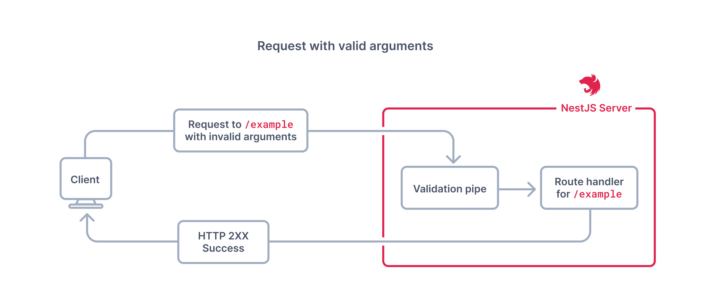
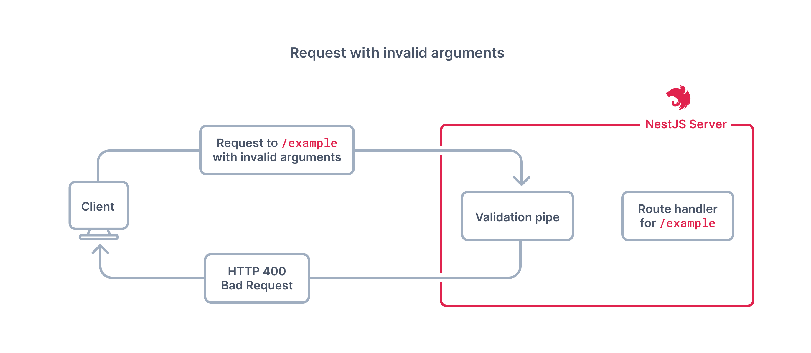
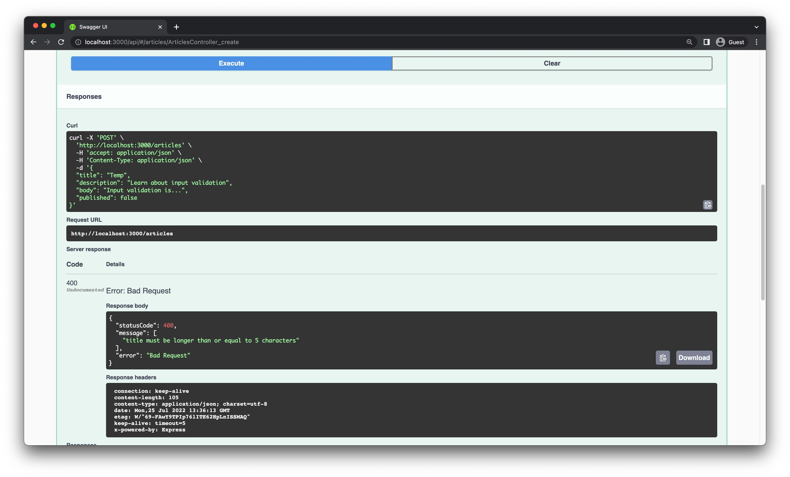
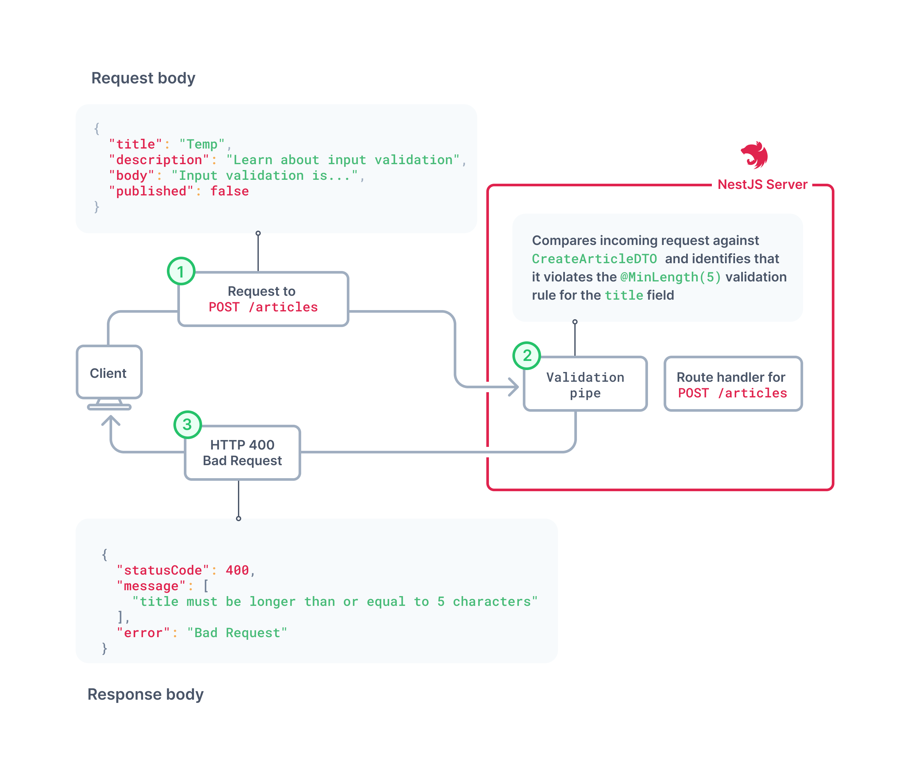
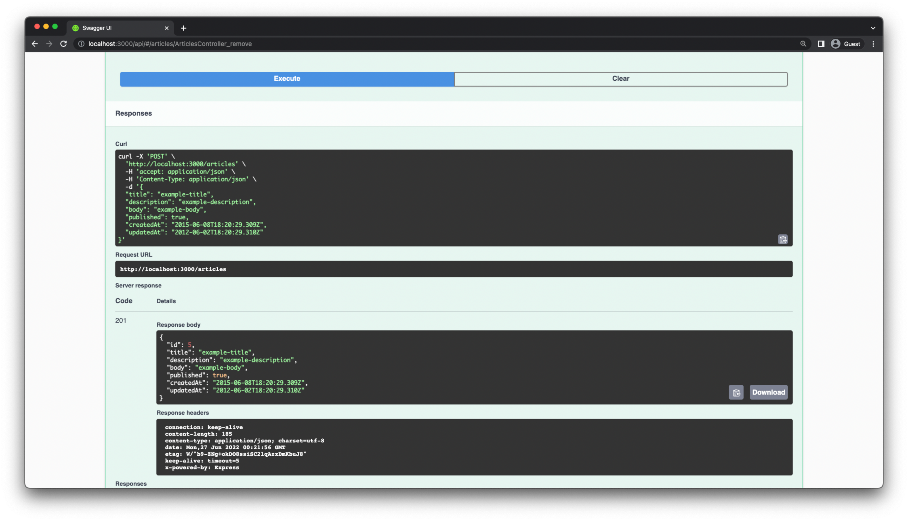

# Pengenalan

Pada bagian pertama dari seri ini, Anda telah membuat proyek NestJS baru dan mengintegrasikannya dengan Prisma, PostgreSQL, dan Swagger. Selanjutnya, Anda membangun REST API yang sederhana untuk backend dari aplikasi blog.

Pada bagian ini, Anda akan belajar bagaimana melakukan validasi input agar sesuai dengan spesifikasi API Anda. Validasi input dilakukan untuk memastikan hanya data yang dibentuk dengan benar dari klien yang dapat melewati API Anda. Ini adalah praktik terbaik untuk memvalidasi kebenaran data yang dikirimkan ke dalam aplikasi web. Hal ini dapat membantu mencegah data yang salah dibentuk dan penyalahgunaan API Anda.

Anda juga akan belajar bagaimana melakukan transformasi input. Transformasi input adalah teknik yang memungkinkan Anda untuk mengintersep dan mengubah data yang dikirim dari klien sebelum diproses oleh handler rute untuk permintaan tersebut. Ini berguna untuk mengkonversi data ke tipe yang sesuai, menerapkan nilai default ke bidang yang hilang, membersihkan input, dll.

# Lingkungan Pengembangan

Untuk mengikuti tutorial ini, Anda diharapkan memiliki:

- Node.js terinstal.
- Docker atau PostgreSQL terinstal.
- Memasang Ekstensi Prisma VSCode (opsional).
- Akses ke shell Unix (seperti terminal di Linux dan macOS) untuk menjalankan perintah yang diberikan dalam seri ini (opsional).


# Struktur Proyek dan Berkas

Repositori yang telah Anda klona seharusnya memiliki struktur berikut:

```
namaProject
  ├── node_modules
  ├── prisma
  │   ├── migrations
  │   ├── schema.prisma
  │   └── seed.ts
  ├── src
  │   ├── app.controller.spec.ts
  │   ├── app.controller.ts
  │   ├── app.module.ts
  │   ├── app.service.ts
  │   ├── main.ts
  │   ├── articles
  │   └── prisma
  ├── test
  │   ├── app.e2e-spec.ts
  │   └── jest-e2e.json
  ├── README.md
  ├── .env
  ├── docker-compose.yml
  ├── nest-cli.json
  ├── package-lock.json
  ├── package.json
  ├── tsconfig.build.json
  └── tsconfig.json
```

Berkas dan direktori yang signifikan dalam repositori ini adalah sebagai berikut:

1. **src**: Direktori ini berisi kode sumber aplikasi. Ada tiga modul di dalamnya:
   - Modul `app` berada di root direktori `src` dan merupakan titik masuk aplikasi. Modul ini bertanggung jawab untuk memulai server web.
   - Modul `prisma` berisi Prisma Client, pengolah kueri basis data Anda.
   - Modul `articles` mendefinisikan endpoint untuk rute `/articles` beserta logika bisnis terkait.

2. **prisma**: Modul ini memiliki:
   - Berkas `schema.prisma` yang mendefinisikan skema basis data.
   - Direktori `migrations` yang berisi sejarah migrasi basis data.
   - Berkas `seed.ts` yang berisi skrip untuk menambahkan data palsu ke basis data pengembangan Anda.

3. **docker-compose.yml**: Berkas ini mendefinisikan gambar Docker untuk basis data PostgreSQL Anda.

4. **.env**: Berkas ini berisi string koneksi basis data PostgreSQL Anda.

# Melakukan Validasi Input

Untuk melakukan validasi input, Anda akan menggunakan NestJS Pipes. Pipes beroperasi pada argumen yang sedang diproses oleh handler rute. Nest memanggil sebuah pipe sebelum handler rute, dan pipe menerima argumen yang dituju untuk handler rute. Pipes dapat melakukan sejumlah hal, seperti memvalidasi input, menambahkan bidang ke input, dll. Pipes mirip dengan middleware, tetapi cakupan pipes terbatas pada pemrosesan argumen input. NestJS menyediakan beberapa pipes secara default, tetapi Anda juga dapat membuat pipes kustom sendiri.

Pipes memiliki dua penggunaan khas:

1. Validasi: Mengevaluasi data input dan, jika valid, meneruskannya tanpa perubahan; sebaliknya, lempar pengecualian saat data tidak benar.

2. Transformasi: Mengubah data input ke bentuk yang diinginkan (misalnya, dari string menjadi integer).

Sebuah pipe validasi NestJS akan memeriksa argumen yang dikirimkan ke rute. Jika argumen tersebut valid, pipe akan meneruskannya ke handler rute tanpa modifikasi apa pun. Namun, jika argumen melanggar salah satu aturan validasi yang ditentukan, pipe akan melemparkan pengecualian.

Diagram-diagram berikut menjelaskan bagaimana pipe validasi bekerja, untuk rute /example yang sembarang.





Pada bagian ini, Anda akan fokus pada kasus penggunaan validasi.

# Menyiapkan ValidationPipe Secara Global

Untuk melakukan validasi input, Anda akan menggunakan ValidationPipe yang sudah ada di NestJS. ValidationPipe menyediakan pendekatan yang nyaman untuk memberlakukan aturan validasi untuk semua data yang masuk dari klien, di mana aturan validasi dideklarasikan dengan menggunakan decorator dari paket class-validator.

Untuk menggunakan fitur ini, Anda perlu menambahkan dua paket ke proyek Anda:

```shell
npm install class-validator class-transformer
```

Paket class-validator menyediakan decorator untuk memvalidasi data masukan, dan paket class-transformer menyediakan decorator untuk mengubah data masukan menjadi bentuk yang diinginkan. Kedua paket ini terintegrasi dengan baik dengan NestJS pipes.

Selanjutnya, impor ValidationPipe pada berkas `main.ts` Anda dan gunakan metode `app.useGlobalPipes` untuk membuatnya tersedia secara global dalam aplikasi Anda:

```typescript
// src/main.ts

import { NestFactory } from '@nestjs/core';
import { AppModule } from './app.module';
import { SwaggerModule, DocumentBuilder } from '@nestjs/swagger';
import { ValidationPipe } from '@nestjs/common';

async function bootstrap() {
  const app = await NestFactory.create(AppModule);

  app.useGlobalPipes(new ValidationPipe());

  const config = new DocumentBuilder()
    .setTitle('Median')
    .setDescription('The Median API description')
    .setVersion('0.1')
    .build();
  const document = SwaggerModule.createDocument(app, config);
  SwaggerModule.setup('api', app, document);

  await app.listen(3000);
}
bootstrap();
```

# Menambahkan Aturan Validasi ke CreateArticleDto

Pada langkah ini, Anda akan menggunakan paket class-validator untuk menambahkan decorator validasi ke CreateArticleDto. Anda akan menerapkan aturan validasi berikut ke CreateArticleDto:

- `title` tidak boleh kosong atau memiliki panjang kurang dari 5 karakter.
- `description` harus memiliki panjang maksimal 300 karakter.
- `body` dan `description` tidak boleh kosong.
- `title`, `description`, dan `body` harus berjenis string, dan `published` harus berjenis boolean.

Buka berkas `src/articles/dto/create-article.dto.ts` dan gantilah isinya dengan yang berikut ini:

```typescript
// src/articles/dto/create-article.dto.ts

import { ApiProperty } from '@nestjs/swagger';
import {
  IsBoolean,
  IsNotEmpty,
  IsOptional,
  IsString,
  MaxLength,
  MinLength,
} from 'class-validator';

export class CreateArticleDto {
  @IsString()
  @IsNotEmpty()
  @MinLength(5)
  @ApiProperty()
  title: string;

  @IsString()
  @IsOptional()
  @IsNotEmpty()
  @MaxLength(300)
  @ApiProperty({ required: false })
  description?: string;

  @IsString()
  @IsNotEmpty()
  @ApiProperty()
  body: string;

  @IsBoolean()
  @IsOptional()
  @ApiProperty({ required: false, default: false })
  published?: boolean = false;
}
```

Aturan-aturan ini akan dikenali oleh ValidationPipe dan diterapkan secara otomatis pada handler rute Anda. Salah satu keuntungan menggunakan decorator untuk validasi adalah bahwa CreateArticleDto tetap menjadi sumber tunggal yang benar untuk semua argumen yang masuk ke endpoint POST /articles. Anda tidak perlu mendefinisikan kelas validasi terpisah.

Cobalah aturan-aturan validasi yang telah Anda terapkan. Cobalah membuat artikel menggunakan endpoint POST /articles dengan judul sementara yang sangat pendek seperti ini:

```json
{
  "title": "Temp",
  "description": "Pelajari tentang validasi input",
  "body": "Validasi input adalah...",
  "published": false
}
```

Anda seharusnya akan mendapatkan respons kesalahan HTTP 400 bersama dengan detail tentang aturan validasi yang dilanggar dalam tubuh respons.



Diagram ini menjelaskan apa yang dilakukan ValidationPipe di bawah keadaan yang tidak valid untuk rute /articles:



## Menghilangkan Properti yang Tidak Diperlukan dari Permintaan Klien

CreateArticleDTO mendefinisikan properti yang perlu dikirim ke endpoint POST /articles untuk membuat artikel baru. UpdateArticleDTO melakukan hal yang sama, tetapi untuk endpoint PATCH /articles/{id}.

Saat ini, untuk kedua endpoint tersebut, memungkinkan untuk mengirim properti tambahan yang tidak didefinisikan dalam DTO. Hal ini dapat menyebabkan bug atau masalah keamanan yang tidak terduga. Misalnya, Anda bisa secara manual mengirimkan nilai createdAt dan updatedAt yang tidak valid ke endpoint POST /articles. Karena informasi tipe TypeScript tidak tersedia saat runtime, aplikasi Anda tidak akan dapat mengidentifikasi bahwa bidang-bidang ini tidak tersedia dalam DTO.

Sebagai contoh, cobalah mengirimkan permintaan berikut ke endpoint POST /articles:

```json
{
  "title": "judul-contoh",
  "description": "deskripsi-contoh",
  "body": "konten-contoh",
  "published": true,
  "createdAt": "2010-06-08T18:20:29.309Z",
  "updatedAt": "2021-06-02T18:20:29.310Z"
}
```


Dengan cara ini, Anda dapat menyuntikkan nilai yang tidak valid. Di sini, Anda telah membuat artikel yang memiliki nilai `updatedAt` yang mendahului `createdAt`, yang tidak masuk akal.

Untuk mencegah hal ini, Anda perlu menyaring semua properti yang tidak diperlukan dari permintaan klien. Untungnya, NestJS juga menyediakan fitur ini secara otomatis. Yang perlu Anda lakukan adalah memberikan opsi `whitelist: true` ketika menginisialisasi ValidationPipe dalam aplikasi Anda.

```typescript
// src/main.ts

import { NestFactory } from '@nestjs/core';
import { AppModule } from './app.module';
import { SwaggerModule, DocumentBuilder } from '@nestjs/swagger';
import { ValidationPipe } from '@nestjs/common';

async function bootstrap() {
  const app = await NestFactory.create(AppModule);

  app.useGlobalPipes(new ValidationPipe({ whitelist: true }));

  const config = new DocumentBuilder()
    .setTitle('Median')
    .setDescription('The Median API description')
    .setVersion('0.1')
    .build();
  const document = SwaggerModule.createDocument(app, config);
  SwaggerModule.setup('api', app, document);

  await app.listen(3000);
}
bootstrap();
```

Dengan opsi ini diatur sebagai `true`, ValidationPipe akan secara otomatis menghapus semua properti yang tidak masuk dalam daftar putih (whitelist), di mana "non-whitelisted" berarti properti tanpa decorator validasi apa pun. Penting untuk diingat bahwa opsi ini akan menyaring semua properti tanpa decorator validasi, bahkan jika mereka didefinisikan dalam DTO.

Sekarang, semua properti/field tambahan yang diteruskan dalam permintaan akan dihapus secara otomatis oleh NestJS, mencegah eksploitasi yang telah ditunjukkan sebelumnya.

## Mengubah Jalur URL Dinamis dengan ParseIntPipe

Dalam API Anda, saat ini Anda menerima parameter id untuk endpoint GET /articles/{id}, PATCH /articles/{id}, dan DELETE /articles/{id} sebagai bagian dari jalur. NestJS mengurai parameter id sebagai string dari jalur URL. Kemudian, string tersebut diubah menjadi angka di dalam kode aplikasi Anda sebelum diteruskan ke ArticlesService. Sebagai contoh, perhatikan handler rute DELETE /articles/{id} berikut:

```typescript
// src/articles/articles.controller.ts

@Delete(':id')
@ApiOkResponse({ type: ArticleEntity })
remove(@Param('id') id: string) {   // id diurai sebagai string
  return this.articlesService.remove(+id); // id diubah menjadi angka menggunakan ekspresi '+id'
}
```

Karena id didefinisikan sebagai tipe string, API Swagger juga mendokumentasikan argumen ini sebagai string dalam dokumentasi API yang dihasilkan. Ini tidak intuitif dan tidak benar.


Daripada melakukan transformasi ini secara manual di dalam handler rute, Anda dapat menggunakan sebuah NestJS pipe untuk mengonversi id menjadi tipe angka secara otomatis. Tambahkan ParseIntPipe bawaan ke handler rute controller untuk tiga endpoint berikut:

```typescript
// src/articles/articles.controller.ts

import {
  Controller,
  Get,
  Post,
  Body,
  Patch,
  Param,
  Delete,
  NotFoundException,
  ParseIntPipe,
} from '@nestjs/common';

export class ArticlesController {
  // ...

  @Get(':id')
  @ApiOkResponse({ type: ArticleEntity })
  findOne(@Param('id', ParseIntPipe) id: number) {
    return this.articlesService.findOne(id);
  }

  @Patch(':id')
  @ApiCreatedResponse({ type: ArticleEntity })
  update(
    @Param('id', ParseIntPipe) id: number,
    @Body() updateArticleDto: UpdateArticleDto,
  ) {
    return this.articlesService.update(id, updateArticleDto);
  }

  @Delete(':id')
  @ApiOkResponse({ type: ArticleEntity })
  remove(@Param('id', ParseIntPipe) id: number) {
    return this.articlesService.remove(id);
  }
}
```

ParseIntPipe akan mengintersep parameter id berjenis string dan secara otomatis menguraikannya menjadi tipe angka sebelum meneruskannya ke handler rute yang sesuai. Ini juga memiliki keuntungan mendokumentasikan parameter id dengan benar sebagai angka di dalam Swagger.


Ringkasan dan Kesimpulan Akhir

Selamat! Dalam tutorial ini, Anda telah mengambil REST API yang sudah ada dan:

1. Mengintegrasikan validasi menggunakan ValidationPipe.
2. Menghapus properti yang tidak perlu dari permintaan klien.
3. Mengintegrasikan ParseIntPipe untuk mengurai variabel jalur bertipe string dan mengonversinya menjadi angka.

Anda mungkin telah melihat bahwa NestJS sangat bergantung pada decorator. Ini adalah pilihan desain yang sangat disengaja. NestJS bertujuan untuk meningkatkan keterbacaan kode dan modularitas dengan sangat memanfaatkan decorator untuk berbagai jenis perhatian potong lintang. Akibatnya, controller dan metode layanan tidak perlu diisi dengan kode boilerplate untuk melakukan hal-hal seperti validasi, penyimpanan cache, logging, dan sebagainya.

Anda dapat menemukan kode lengkap untuk tutorial ini di cabang end-validation dari repositori GitHub. Jangan ragu untuk mengajukan isu di repositori atau mengirimkan permintaan tarik jika Anda menemui masalah. Anda juga dapat menghubungi saya langsung di Twitter.

